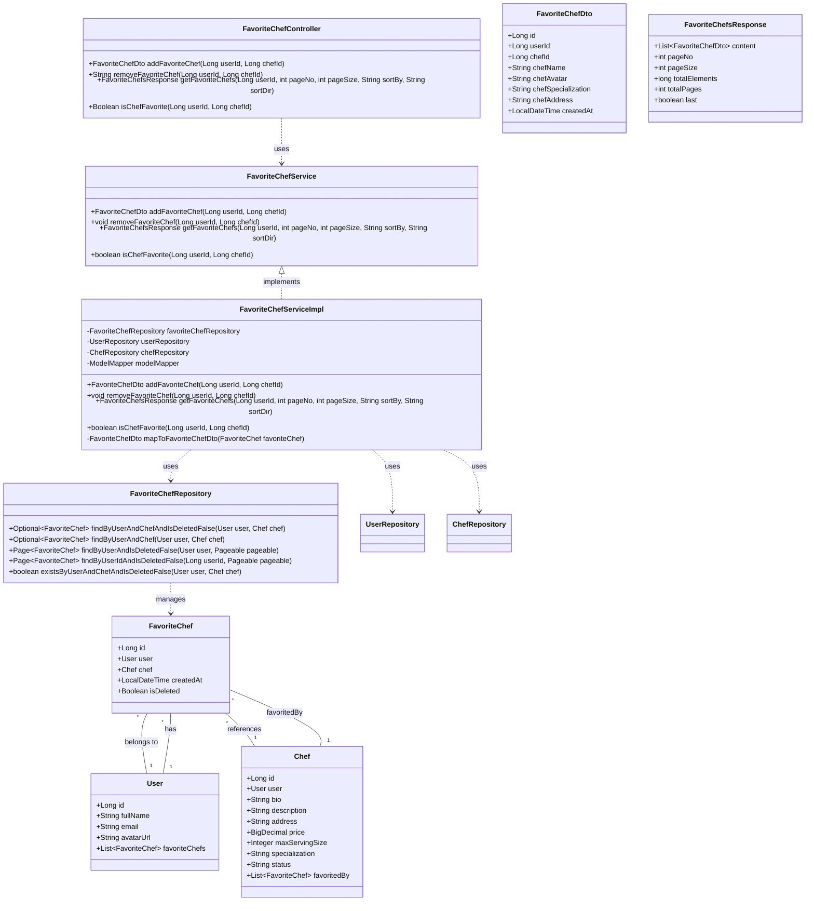
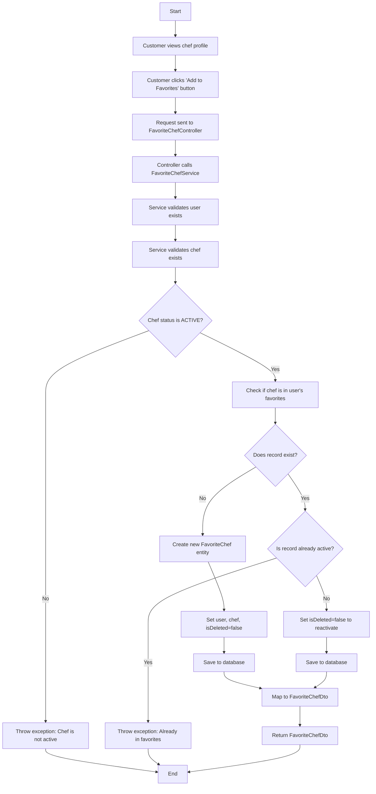
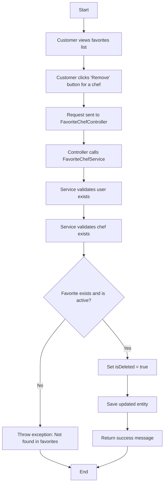
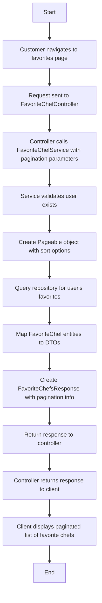
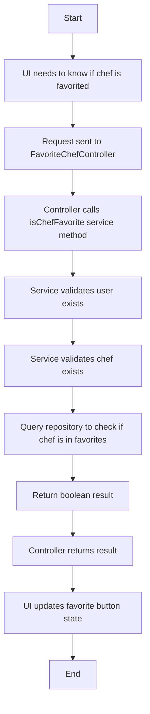
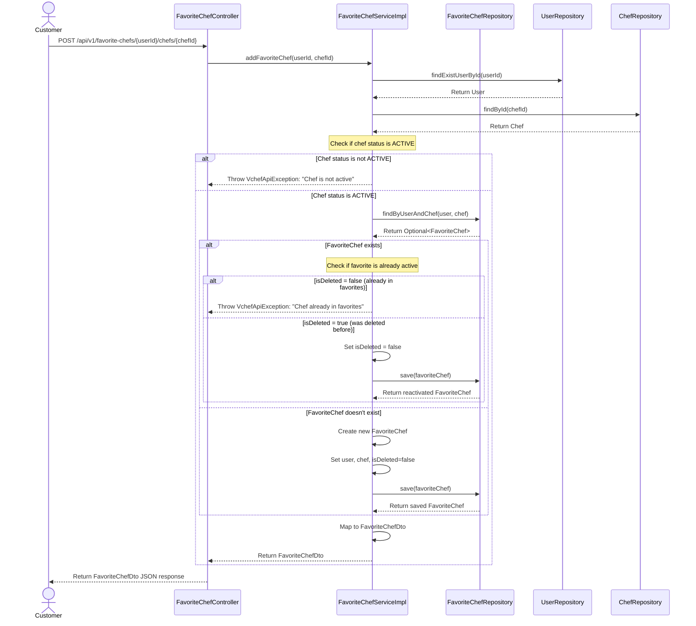
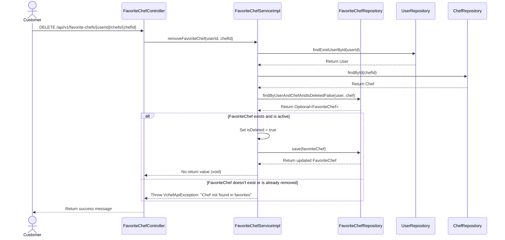
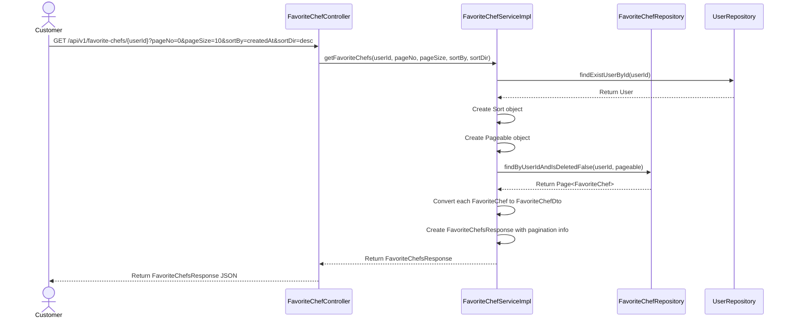
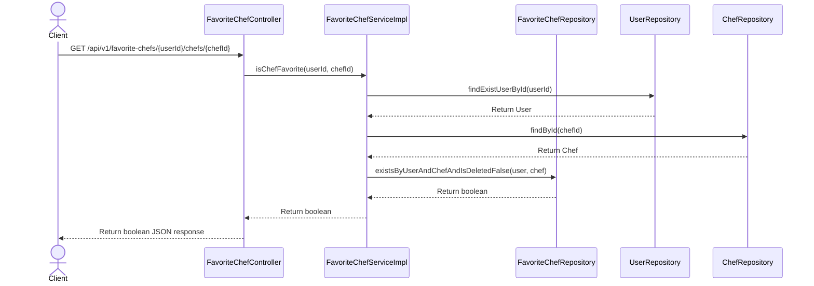

# Favorite Chef System Feature Documentation

## Introduction
This document describes the favorite chef system feature of the VietChef application, which allows customers to save their favorite chefs for easy access and tracking.

## Class Diagram
The following class diagram illustrates the relationships between the main components of the favorite chef system feature:

## Activity Diagrams

### Add Favorite Chef Activity Diagram
This diagram illustrates the flow of operations for adding a chef to favorites:

### Remove Favorite Chef Activity Diagram
This diagram shows the process of removing a chef from favorites:

### Get Favorite Chefs Activity Diagram
This diagram details the process of retrieving a user's favorite chefs:

### Check Favorite Status Activity Diagram
This diagram illustrates the process of checking if a chef is in a user's favorites:

## Sequence Diagrams

### Add Favorite Chef Sequence Diagram
This sequence diagram details the process of adding a chef to a user's favorites:

### Remove Favorite Chef Sequence Diagram
This sequence diagram shows the process of removing a chef from favorites:

### Get Favorite Chefs Sequence Diagram
This sequence diagram illustrates the process of retrieving a user's favorite chefs with pagination:

### Check Favorite Status Sequence Diagram
This sequence diagram shows the process of checking if a chef is in a user's favorites:

## Abbreviations
- FC: FavoriteChefController
- FS: FavoriteChefServiceImpl
- FCR: FavoriteChefRepository
- UR: UserRepository
- CR: ChefRepository 