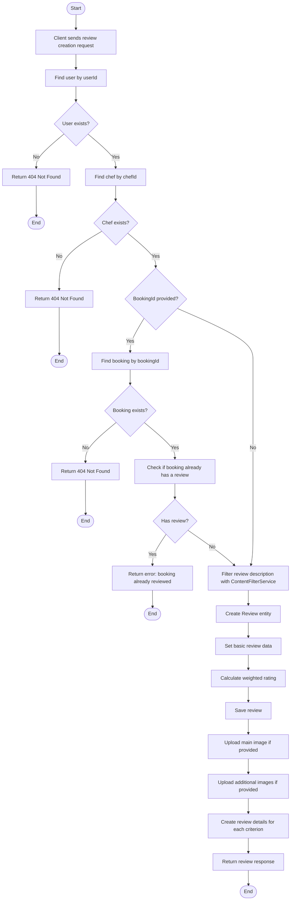
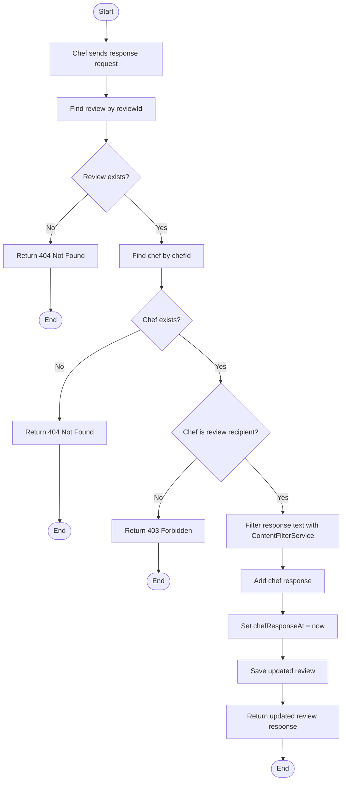
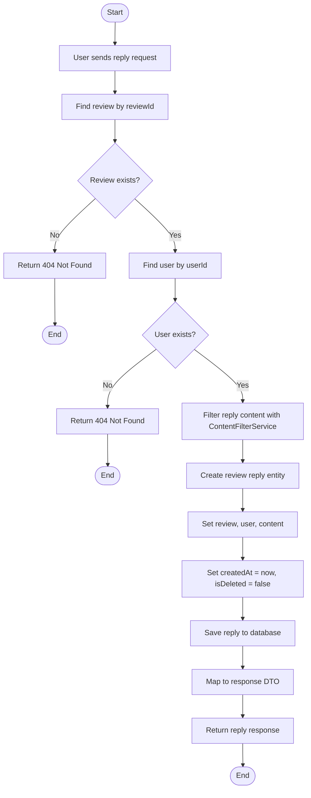
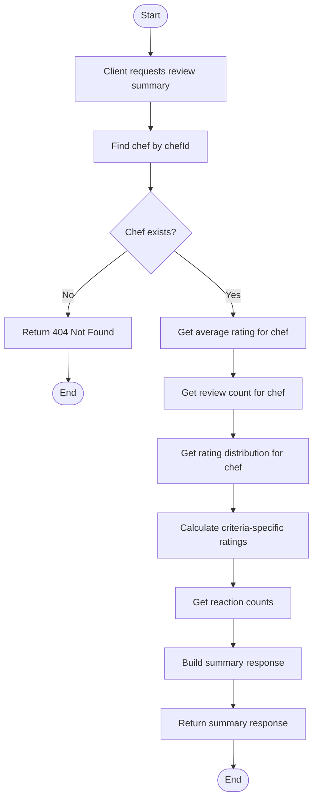
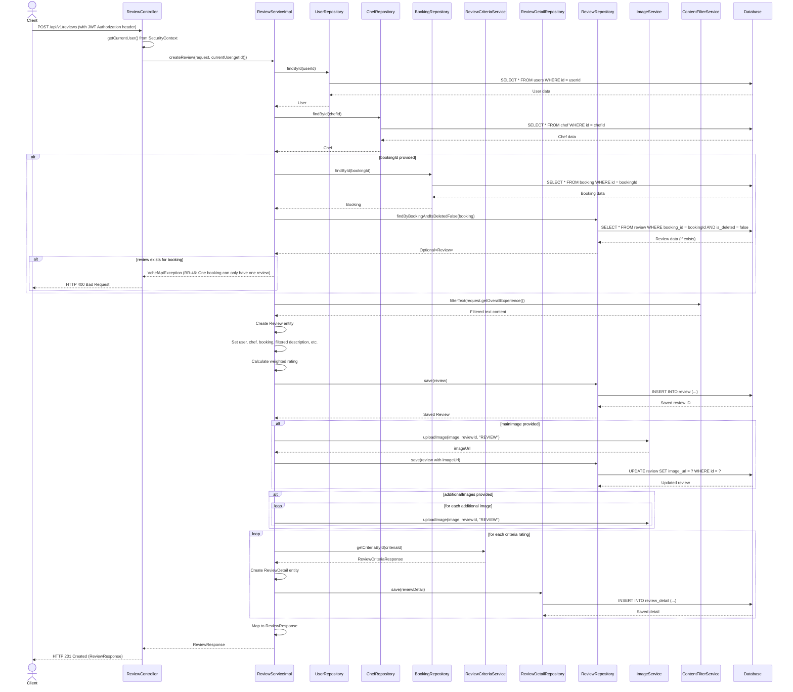
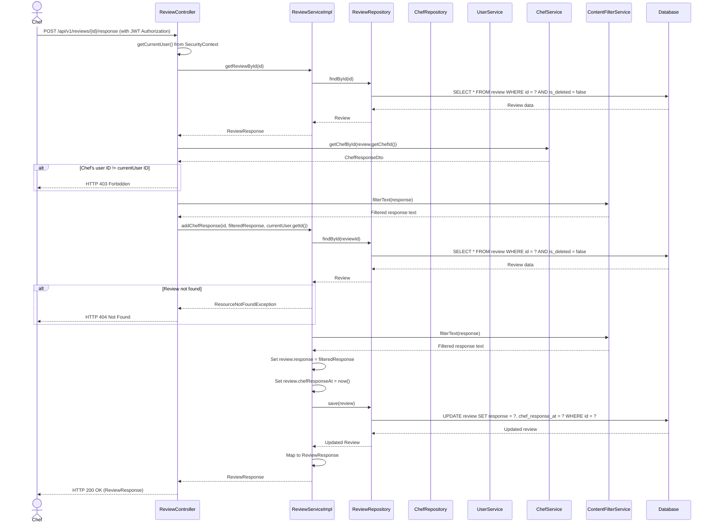
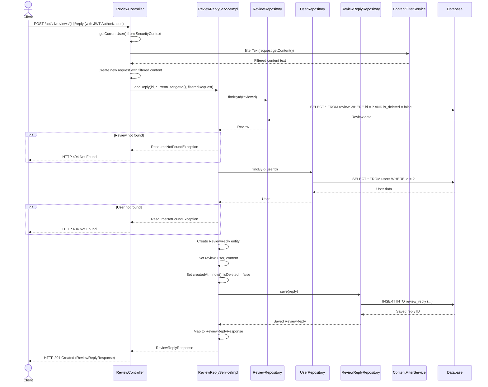
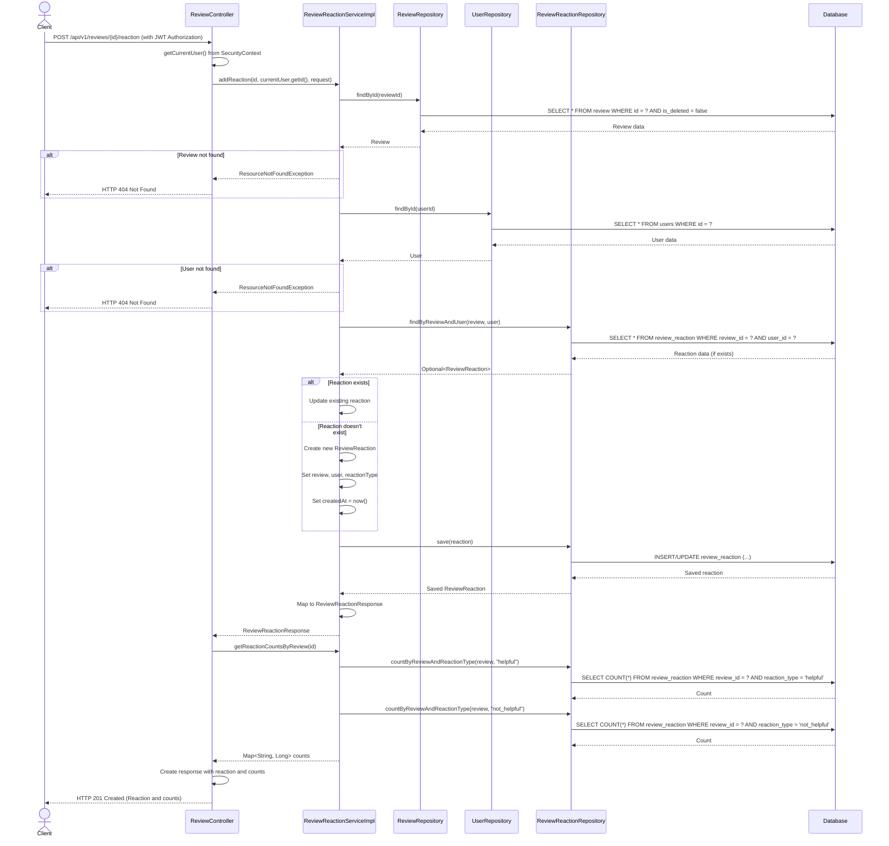
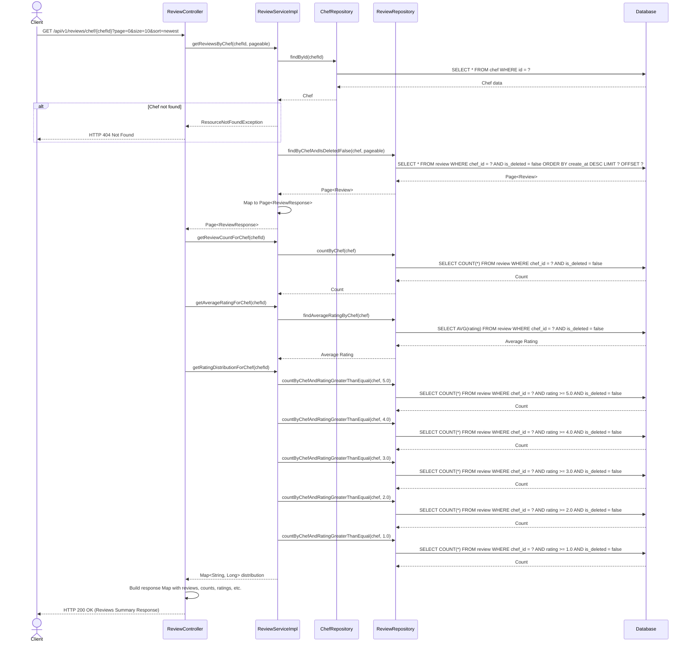

# Review System Diagrams

## Introduction
This document provides comprehensive diagrams representing the architecture and flow of the Review System in the VietChef application. These diagrams aim to provide a clear understanding of the system's structure and behavior.

## Class Diagram

```mermaid
classDiagram
    class Review {
        -Long id
        -User user
        -Chef chef
        -Booking booking
        -BigDecimal rating
        -String description
        -String overallExperience
        -String imageUrl
        -String response
        -LocalDateTime chefResponseAt
        -LocalDateTime createAt
        -Boolean isDeleted
        +List~ReviewDetail~ reviewDetails
        +List~ReviewReply~ replies
        +List~ReviewReaction~ reactions
    }

    class ReviewDetail {
        -Long detailId
        -BigDecimal rating
        -Review review
        -ReviewCriteria criteria
    }

    class ReviewCriteria {
        -Long criteriaId
        -String name
        -String description
        -BigDecimal weight
        -Boolean isActive
        -Integer displayOrder
        +List~ReviewDetail~ reviewDetails
    }

    class ReviewReply {
        -Long replyId
        -String content
        -LocalDateTime createdAt
        -Boolean isDeleted
        -Review review
        -User user
    }

    class ReviewReaction {
        -Long reactionId
        -String reactionType
        -LocalDateTime createdAt
        -Review review
        -User user
    }

    class ReviewRepository {
        +findByChefAndIsDeletedFalseOrderByCreateAtDesc(Chef chef)
        +findByChefAndIsDeletedFalse(Chef chef, Pageable pageable)
        +findByUserAndIsDeletedFalseOrderByCreateAtDesc(User user)
        +findByBookingAndIsDeletedFalse(Booking booking)
        +findAverageRatingByChef(Chef chef)
        +countByChef(Chef chef)
        +countByChefAndRatingGreaterThanEqual(Chef chef, BigDecimal rating)
    }

    class ReviewDetailRepository {
        +findByReviewId(Long reviewId)
        +findByReview(Review review)
        +findByReviewAndCriteria(Review review, ReviewCriteria criteria)
    }

    class ReviewCriteriaRepository {
        +findByIsActiveTrue()
        +findByIsActiveTrueOrderByDisplayOrderAsc()
        +findByName(String name)
    }

    class ReviewReplyRepository {
        +findByReviewAndIsDeletedFalseOrderByCreatedAtDesc(Review review)
        +findByUserAndIsDeletedFalseOrderByCreatedAtDesc(User user)
    }

    class ReviewReactionRepository {
        +findByReview(Review review)
        +findByReviewAndReactionType(Review review, String reactionType)
        +findByReviewAndUser(Review review, User user)
        +countByReviewAndReactionType(Review review, String reactionType)
    }
    
    class ContentFilterService {
        -Set~String~ profanityWords
        -String REPLACEMENT
        +ContentFilterService()
        -loadProfanityWords()
        +filterText(String text) : String
        +containsProfanity(String text) : boolean
        +findProfanityWords(String text) : List~String~
    }

    class ReviewController {
        -ReviewService reviewService
        -ReviewCriteriaService reviewCriteriaService
        -ReviewReplyService reviewReplyService
        -ReviewReactionService reviewReactionService
        -ContentFilterService contentFilterService
        +createReview(ReviewCreateRequest request, Long userId)
        +updateReview(Long reviewId, ReviewUpdateRequest request, Long userId)
        +deleteReview(Long reviewId)
        +getReviewById(Long reviewId)
        +getReviewsByUserId(Long userId)
        +getReviewsByChefId(Long chefId, Pageable pageable)
        +addChefResponse(Long reviewId, String response, Long chefId)
        +getAverageRatingForChef(Long chefId)
        +getReviewCountForChef(Long chefId)
        +getRatingDistributionForChef(Long chefId)
    }

    class ReviewService {
        <<interface>>
        +getReviewById(Long id)
        +getReviewsByChef(Long chefId)
        +getReviewsByChef(Long chefId, Pageable pageable)
        +getReviewsByUser(Long userId)
        +getReviewByBooking(Long bookingId)
        +createReview(ReviewCreateRequest request, Long userId)
        +updateReview(Long id, ReviewUpdateRequest request, Long userId)
        +deleteReview(Long id)
        +addChefResponse(Long reviewId, String response, Long chefId)
        +calculateWeightedRating(Map~Long, BigDecimal~ criteriaRatings)
        +getAverageRatingForChef(Long chefId)
        +getReviewCountForChef(Long chefId)
        +getRatingDistributionForChef(Long chefId)
    }

    class ReviewServiceImpl {
        -ReviewRepository reviewRepository
        -ReviewDetailRepository reviewDetailRepository
        -ReviewCriteriaService reviewCriteriaService
        -ReviewReactionService reviewReactionService
        -BookingRepository bookingRepository
        -UserRepository userRepository
        -ChefRepository chefRepository
        -ImageRepository imageRepository
        -ImageService imageService
        -ContentFilterService contentFilterService
        +getReviewById(Long id)
        +getReviewsByChef(Long chefId)
        +getReviewsByChef(Long chefId, Pageable pageable)
        +getReviewsByUser(Long userId)
        +getReviewByBooking(Long bookingId)
        +createReview(ReviewCreateRequest request, Long userId)
        +updateReview(Long id, ReviewUpdateRequest request, Long userId)
        +deleteReview(Long id)
        +addChefResponse(Long reviewId, String response, Long chefId)
        +calculateWeightedRating(Map~Long, BigDecimal~ criteriaRatings)
        +getAverageRatingForChef(Long chefId)
        +getReviewCountForChef(Long chefId)
        +getRatingDistributionForChef(Long chefId)
        -mapToResponse(Review review)
        -mapToCriteriaEntity(ReviewCriteriaResponse response)
    }

    class ReviewCriteriaService {
        <<interface>>
        +getAllCriteria()
        +getActiveCriteria()
        +getCriteriaById(Long id)
        +createCriteria(ReviewCriteriaRequest request)
        +updateCriteria(Long id, ReviewCriteriaRequest request)
        +deleteCriteria(Long id)
        +initDefaultCriteria()
    }

    class ReviewCriteriaServiceImpl {
        -ReviewCriteriaRepository criteriaRepository
        +getAllCriteria()
        +getActiveCriteria()
        +getCriteriaById(Long id)
        +createCriteria(ReviewCriteriaRequest request)
        +updateCriteria(Long id, ReviewCriteriaRequest request)
        +deleteCriteria(Long id)
        +initDefaultCriteria()
        -createDefaultCriterion(String name, String description, BigDecimal weight, int displayOrder)
        -mapToResponse(ReviewCriteria criteria)
        -mapToEntity(ReviewCriteriaRequest request, ReviewCriteria criteria)
    }

    class ReviewReplyService {
        <<interface>>
        +addReply(Long reviewId, Long userId, ReviewReplyRequest request)
        +updateReply(Long replyId, ReviewReplyRequest request)
        +deleteReply(Long replyId)
        +getRepliesByReview(Long reviewId)
        +getRepliesByUser(Long userId)
    }

    class ReviewReplyServiceImpl {
        -ReviewReplyRepository reviewReplyRepository
        -ReviewRepository reviewRepository
        -UserRepository userRepository
        +addReply(Long reviewId, Long userId, ReviewReplyRequest request)
        +updateReply(Long replyId, ReviewReplyRequest request)
        +deleteReply(Long replyId)
        +getRepliesByReview(Long reviewId)
        +getRepliesByUser(Long userId)
        -mapToResponse(ReviewReply reply)
    }

    class ReviewReactionService {
        <<interface>>
        +addReaction(Long reviewId, Long userId, ReviewReactionRequest request)
        +updateReaction(Long reactionId, ReviewReactionRequest request)
        +removeReaction(Long reactionId)
        +getReactionsByReview(Long reviewId)
        +hasUserReacted(Long reviewId, Long userId)
        +getReactionCountsByReview(Long reviewId)
    }

    class ReviewReactionServiceImpl {
        -ReviewReactionRepository reviewReactionRepository
        -ReviewRepository reviewRepository
        -UserRepository userRepository
        +addReaction(Long reviewId, Long userId, ReviewReactionRequest request)
        +updateReaction(Long reactionId, ReviewReactionRequest request)
        +removeReaction(Long reactionId)
        +getReactionsByReview(Long reviewId)
        +hasUserReacted(Long reviewId, Long userId)
        +getReactionCountsByReview(Long reviewId)
        -mapToResponse(ReviewReaction reaction)
    }

    Review "1" --o "*" ReviewDetail : contains
    Review "1" --o "*" ReviewReply : has
    Review "1" --o "*" ReviewReaction : has
    ReviewDetail "*" --o "1" ReviewCriteria : uses
    
    ReviewController --> ReviewService : uses
    ReviewController --> ReviewCriteriaService : uses
    ReviewController --> ReviewReplyService : uses
    ReviewController --> ReviewReactionService : uses
    ReviewController --> ContentFilterService : uses
    
    ReviewService <|.. ReviewServiceImpl : implements
    ReviewCriteriaService <|.. ReviewCriteriaServiceImpl : implements
    ReviewReplyService <|.. ReviewReplyServiceImpl : implements
    ReviewReactionService <|.. ReviewReactionServiceImpl : implements
    
    ReviewServiceImpl --> ReviewRepository : uses
    ReviewServiceImpl --> ReviewDetailRepository : uses
    ReviewServiceImpl --> ReviewCriteriaService : uses
    ReviewServiceImpl --> ReviewReactionService : uses
    ReviewServiceImpl --> UserRepository : uses
    ReviewServiceImpl --> ChefRepository : uses
    ReviewServiceImpl --> BookingRepository : uses
    ReviewServiceImpl --> ImageRepository : uses
    ReviewServiceImpl --> ImageService : uses
    ReviewServiceImpl --> ContentFilterService : uses
    
    ReviewCriteriaServiceImpl --> ReviewCriteriaRepository : uses
    ReviewReplyServiceImpl --> ReviewReplyRepository : uses
    ReviewReplyServiceImpl --> ReviewRepository : uses
    ReviewReplyServiceImpl --> UserRepository : uses
    ReviewReactionServiceImpl --> ReviewReactionRepository : uses
    ReviewReactionServiceImpl --> ReviewRepository : uses
    ReviewReactionServiceImpl --> UserRepository : uses
```



## Activity Diagrams

### Review Creation Activity Diagram


### Chef Response Activity Diagram


### Review Reply Activity Diagram


### Review Reaction Activity Diagram
```mermaid
flowchart TD
    Start([Start]) --> A[User sends reaction request]
    A --> B[Find review by reviewId]
    B --> C{Review exists?}
    C -->|No| D[Return 404 Not Found]
    D --> End1([End])
    C -->|Yes| E[Find user by userId]
    E --> F{User exists?}
    F -->|No| G[Return 404 Not Found]
    G --> End2([End])
    F -->|Yes| H[Check if user already reacted]
    H --> I{Has existing reaction?}
    I -->|Yes| J[Update existing reaction]
    I -->|No| K[Create new reaction entity]
    K --> L[Set review, user, reactionType]
    L --> M[Set createdAt = now()]
    M --> N[Save reaction to database]
    J --> N
    N --> O[Map to response DTO]
    O --> P[Return reaction response]
    P --> End3([End])
```

### Review Summary Activity Diagram


## Sequence Diagrams

### Create Review Sequence Diagram


### Chef Response Sequence Diagram


### Add Review Reply Sequence Diagram


### Add Review Reaction Sequence Diagram


### Get Review Summary Sequence Diagram


## Abbreviations
- **DTO**: Data Transfer Object
- **API**: Application Programming Interface
- **CRUD**: Create, Read, Update, Delete
- **JPA**: Java Persistence API 
- **DB**: Database 