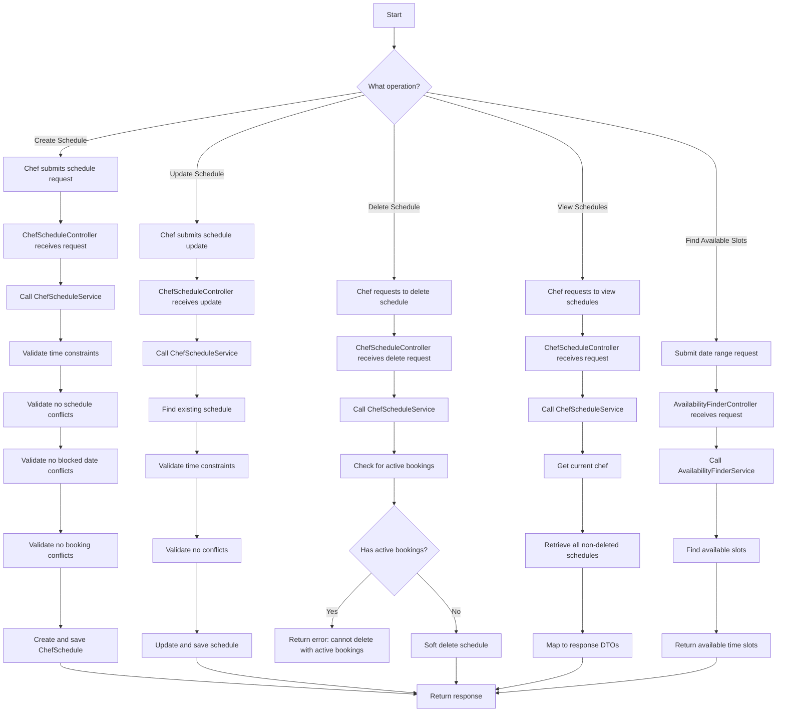
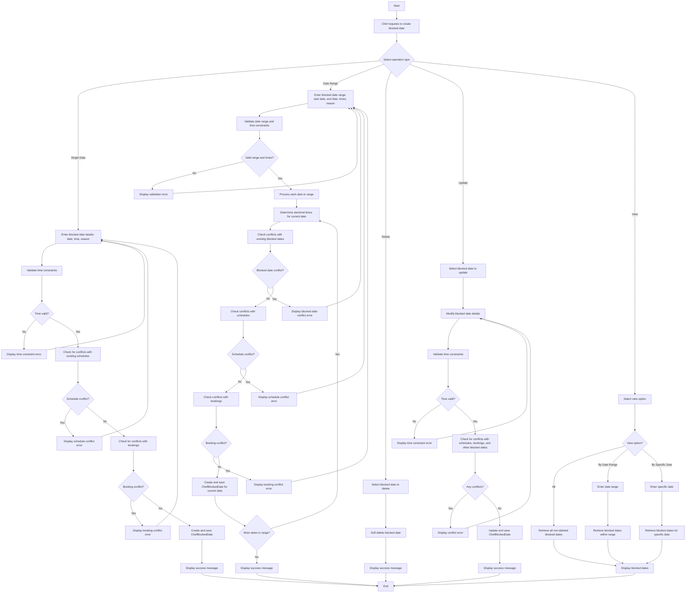
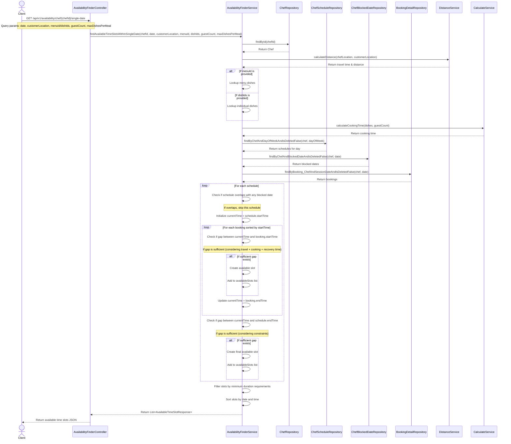
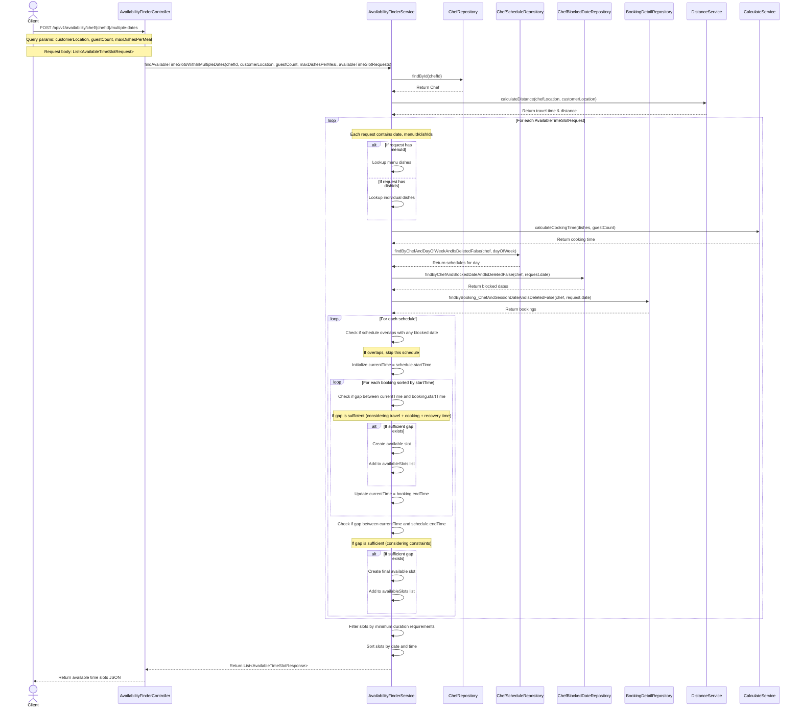

# Schedule Management Feature Documentation

## Introduction
This document describes the schedule management feature of the VietChef application, including chef schedules, chef blocked dates, and availability slots finder.

## Class Diagram
The following class diagram illustrates the relationships between the main components of the schedule management feature:

```mermaid
classDiagram
    %% Controllers
    class ChefScheduleController {
        +createSchedule(ChefScheduleRequest request) : ChefScheduleResponse
        +createMultipleSchedules(ChefMultipleScheduleRequest request) : List~ChefScheduleResponse~
        +getScheduleById(Long scheduleId) : ChefScheduleResponse
        +getSchedulesForCurrentChef() : List~ChefScheduleResponse~
        +updateSchedule(ChefScheduleUpdateRequest request) : ChefScheduleResponse
        +deleteSchedule(Long scheduleId) : void
        +deleteSchedulesByDayOfWeek(Integer dayOfWeek) : void
    }
    
    class ChefBlockedDateController {
        +createBlockedDate(ChefBlockedDateRequest request) : ChefBlockedDateResponse
        +createBlockedDateRange(ChefBlockedDateRangeRequest request) : List~ChefBlockedDateResponse~
        +getBlockedDateById(Long blockId) : ChefBlockedDateResponse
        +getBlockedDatesForCurrentChef() : List~ChefBlockedDateResponse~
        +getBlockedDatesBetween(LocalDate startDate, LocalDate endDate) : List~ChefBlockedDateResponse~
        +getBlockedDatesByDate(LocalDate date) : List~ChefBlockedDateResponse~
        +updateBlockedDate(ChefBlockedDateUpdateRequest request) : ChefBlockedDateResponse
        +deleteBlockedDate(Long blockId) : void
    }
    
    class AvailabilityFinderController {
        +findAvailableTimeSlotsForChef(Long chefId, LocalDate startDate, LocalDate endDate) : List~AvailableTimeSlotResponse~
        +findAvailableTimeSlotsForCurrentChef(LocalDate startDate, LocalDate endDate) : List~AvailableTimeSlotResponse~
        +findAvailableTimeSlotsForChefByDate(Long chefId, LocalDate date) : List~AvailableTimeSlotResponse~
        +checkTimeSlotAvailability(Long chefId, LocalDate date, LocalTime startTime, LocalTime endTime) : Boolean
        +findAvailableTimeSlotsInSingleDate(Long chefId, LocalDate date, String customerLocation, Long menuId, List~Long~ dishIds, int guestCount, int maxDishesPerMeal) : List~AvailableTimeSlotResponse~
        +findAvailableTimeSlotsInMultipleDates(Long chefId, String customerLocation, int guestCount, int maxDishesPerMeal, List~AvailableTimeSlotRequest~ requests) : List~AvailableTimeSlotResponse~
    }
    
    %% Entities and Models
    class Chef {
        +Long id
        +User user
        +String bio
        +String description
        +String address
        +BigDecimal price
        +Integer maxServingSize
        +String status
        +Boolean isDeleted
        +String specialization
        +List~ChefSchedule~ schedules
    }

    class User {
        +Long id
        +String fullName
        +String email
    }
    
    class ChefSchedule {
        +Long id
        +Chef chef
        +Integer dayOfWeek
        +LocalTime startTime
        +LocalTime endTime
        +Boolean isDeleted
    }
    
    class ChefBlockedDate {
        +Long blockId
        +Chef chef
        +LocalDate blockedDate
        +LocalTime startTime
        +LocalTime endTime
        +String reason
        +Boolean isDeleted
    }
    
    class BookingDetail {
        +Long id
        +Booking booking
        +LocalDate sessionDate
        +LocalTime startTime
        +LocalTime endTime
        +LocalTime timeBeginTravel
        +String status
        +Boolean isDeleted
    }
    
    %% Services
    class AvailabilityFinderService {
        +findAvailableTimeSlotsForChef(Long chefId, LocalDate startDate, LocalDate endDate) : List~AvailableTimeSlotResponse~
        +findAvailableTimeSlotsForCurrentChef(LocalDate startDate, LocalDate endDate) : List~AvailableTimeSlotResponse~
        +findAvailableTimeSlotsForChefByDate(Long chefId, LocalDate date) : List~AvailableTimeSlotResponse~
        +isTimeSlotAvailable(Long chefId, LocalDate date, LocalTime startTime, LocalTime endTime) : boolean
        +findAvailableTimeSlotsWithInSingleDate(Long chefId, LocalDate date, String customerLocation, Long menuId, List~Long~ dishIds, int guestCount, int maxDishesPerMeal) : List~AvailableTimeSlotResponse~
        +findAvailableTimeSlotsWithInMultipleDates(Long chefId, String customerLocation, int guestCount, int maxDishesPerMeal, List~AvailableTimeSlotRequest~) : List~AvailableTimeSlotResponse~
    }
    
    class ChefScheduleService {
        +createScheduleForCurrentChef(ChefScheduleRequest request) : ChefScheduleResponse
        +createMultipleSchedulesForCurrentChef(ChefMultipleScheduleRequest request) : List~ChefScheduleResponse~
        +getScheduleById(Long scheduleId) : ChefScheduleResponse
        +getSchedulesForCurrentChef() : List~ChefScheduleResponse~
        +updateSchedule(ChefScheduleUpdateRequest request) : ChefScheduleResponse
        +deleteSchedule(Long scheduleId) : void
        +deleteSchedulesByDayOfWeek(Integer dayOfWeek) : void
    }
    
    class ChefBlockedDateService {
        +createBlockedDateForCurrentChef(ChefBlockedDateRequest request) : ChefBlockedDateResponse
        +createBlockedDateRangeForCurrentChef(ChefBlockedDateRangeRequest request) : List~ChefBlockedDateResponse~
        +getBlockedDateById(Long blockId) : ChefBlockedDateResponse
        +getBlockedDatesForCurrentChef() : List~ChefBlockedDateResponse~
        +getBlockedDatesForCurrentChefBetween(LocalDate startDate, LocalDate endDate) : List~ChefBlockedDateResponse~
        +getBlockedDatesForCurrentChefByDate(LocalDate date) : List~ChefBlockedDateResponse~
        +updateBlockedDate(ChefBlockedDateUpdateRequest request) : ChefBlockedDateResponse
        +deleteBlockedDate(Long blockId) : void
    }
    
    class BookingConflictService {
        +hasBookingConflict(Chef chef, LocalDate date, LocalTime startTime, LocalTime endTime) : boolean
        +hasBookingConflictOnDayOfWeek(Chef chef, Integer dayOfWeek, LocalTime startTime, LocalTime endTime, Integer daysToCheck) : boolean
        +hasActiveBookingsForDayOfWeek(Long chefId, Integer dayOfWeek) : boolean
    }
    
    %% DTOs
    class AvailableTimeSlotResponse {
        +Long chefId
        +String chefName
        +LocalDate date
        +LocalTime startTime
        +LocalTime endTime
        +Integer durationMinutes
    }

    class AvailableTimeSlotRequest {
        +LocalDate date
        +Long menuId
        +List~Long~ dishIds
    }
    
    %% Relationships
    Chef "1" -- "1" User
    Chef "1" -- "*" ChefSchedule
    Chef "1" -- "*" ChefBlockedDate
    
    %% Controller-Service relationships
    ChefScheduleController ..> ChefScheduleService: uses
    ChefBlockedDateController ..> ChefBlockedDateService: uses
    AvailabilityFinderController ..> AvailabilityFinderService: uses
    
    %% Service relationships
    AvailabilityFinderService ..> ChefSchedule: uses
    AvailabilityFinderService ..> ChefBlockedDate: uses
    AvailabilityFinderService ..> BookingDetail: uses
    AvailabilityFinderService ..> DistanceService: uses
    AvailabilityFinderService ..> CalculateService: uses
    ChefScheduleService ..> BookingConflictService: uses
    ChefBlockedDateService ..> BookingConflictService: uses
```

## Activity Diagrams

### Schedule Management Activity Diagram
This diagram illustrates the flow of operations for managing chef schedules, including creation, updates, deletion, and viewing:

### Chef Blocked Date Activity Diagram
This diagram shows the comprehensive process of managing chef blocked dates, including creating single/range blocks, updating, deleting, and viewing blocked dates:

## Sequence Diagrams

### Single Date Availability Search (GET /api/v1/availability/chef/{chefId}/single-date)
This sequence diagram details the process of finding available time slots for a chef on a specific date, accounting for travel time, cooking time, and existing commitments:

### Multiple Dates Availability Search (POST /api/v1/availability/chef/{chefId}/multiple-dates)
This sequence diagram shows the process of finding available time slots across multiple dates with potentially different requirements for each date:

## API Endpoints

### Chef Schedule Endpoints
- **POST** `/api/v1/chef-schedules` - Create a new schedule for the current chef
- **POST** `/api/v1/chef-schedules/multiple` - Create multiple schedules for the current chef
- **GET** `/api/v1/chef-schedules/{scheduleId}` - Get schedule by ID
- **GET** `/api/v1/chef-schedules/me` - Get all schedules for the current chef
- **PUT** `/api/v1/chef-schedules` - Update a chef schedule
- **DELETE** `/api/v1/chef-schedules/{scheduleId}` - Delete a chef schedule
- **DELETE** `/api/v1/chef-schedules/day/{dayOfWeek}` - Delete all schedules for a specific day of week

### Chef Blocked Date Endpoints
- **POST** `/api/v1/chef-blocked-dates` - Create a new blocked date
- **POST** `/api/v1/chef-blocked-dates/range` - Create a range of blocked dates
- **GET** `/api/v1/chef-blocked-dates/{blockId}` - Get blocked date by ID
- **GET** `/api/v1/chef-blocked-dates/me` - Get all blocked dates for the current chef
- **GET** `/api/v1/chef-blocked-dates/range` - Get blocked dates in a date range
- **GET** `/api/v1/chef-blocked-dates/date/{date}` - Get blocked dates for a specific date
- **PUT** `/api/v1/chef-blocked-dates` - Update a blocked date
- **DELETE** `/api/v1/chef-blocked-dates/{blockId}` - Delete a blocked date

### Availability Finder Endpoints
- **GET** `/api/v1/availability/chef/{chefId}` - Find available time slots for a chef in a date range
- **GET** `/api/v1/availability/chef/me` - Find available time slots for the current chef
- **GET** `/api/v1/availability/chef/{chefId}/date/{date}` - Find available time slots for a chef on a specific date
- **GET** `/api/v1/availability/chef/{chefId}/check` - Check if a specific time slot is available
- **GET** `/api/v1/availability/chef/{chefId}/single-date` - Find available time slots considering travel and cooking time
- **POST** `/api/v1/availability/chef/{chefId}/multiple-dates` - Find available time slots across multiple dates

## Abbreviations
- AC: AvailabilityFinderController
- AFS: AvailabilityFinderService
- CR: ChefRepository
- CSR: ChefScheduleRepository
- CBDR: ChefBlockedDateRepository
- BDR: BookingDetailRepository
- DS: DistanceService
- CS: CalculateService
